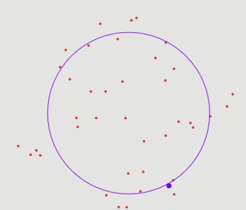
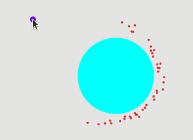
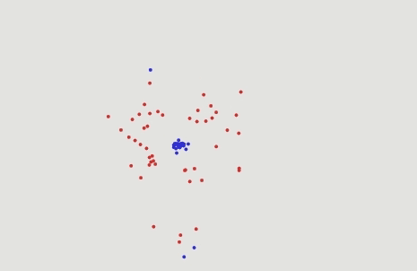

# Assignment 3 - Boids

## 1) Integration schemes

</img>

### Explicit Euler
Is not stable. Even with a step size of *0.01* we notice after a short time that the points start drifting out. At *0.1* the points spiral out extremely fast.

### Symplectic Euler
Extremely stable. For all step sizes *(1, 0.1, 0.01, ...)*, the points remain on their orbit without drifting in/out (simulated for about a minute)

### Explicit Midpoint
Seems stable at first with a step size of *0.01*, but an outward drift is noticeable at *0.1* after a while (after waiting for about a minute).

You can see a brief visualization of the different behaviors [here](https://drive.google.com/file/d/1pirS4XB1_cnchWmmnBqkUz4DTgj2aJNN/view?usp=sharing). Note that one of the boids is selected at random and a circle with the boid's original radius is created to better visualize whether the boids are staying on their trajectory or drifing in/out.

## 2) Flocking

</img>

### Cohesion
The implementation is straightforward and the result can be seen [here](https://drive.google.com/file/d/11G0RSSkgW1YGRBbsh0OYio5TMVXqHPqU/view?usp=sharing).

### Alignment
The implementation is a bit more complicated as something I noticed is that when boids align, they start adding alignment force to each other, which quickly escalates and the boids gain a lot of speed. I had to play with the alignment force and radius quite a bit to have something more or less stable, as can be seen [here](https://drive.google.com/file/d/15xPgC0euwJOrzZs-AhMLO8jdg_GkyIp_/view?usp=sharing). To fix this, I came up with another implementation that only adds an alignment force inversely proportional to the alignment (the more aligned, the less alignment force is applied). This makes the simulation much more stable as can be seen [here](https://drive.google.com/file/d/1KioYG6NcHEYJ8d0a55p2PqauHIkNdZJv/view?usp=sharing).

### Separation
Separation implementation is not too difficult although some care must be taken. I made it so that the separation strength is inversely proportional to the distance. As you can see [here](https://drive.google.com/file/d/1cXAbhQ-1HkU8C-YsbXraXVBQE7UbmfYR/view?usp=sharing), the boids avoid any contact. The force and the detection can be changed to achieve more or less separation behavior. It turns out that these parameters work really well when used for the leader following task.

### Collision avoidance
A naive implementation where a force is applied perpendicular to the surface makes the boids bounce off when they get too close, sometimes with a huge force in the case where a boid gets near enough to the boundary (e.g. if it has a large initial speed). Since the force is inversely proportional to the distance, there is a big bounce which is not desirable. Tweaking the detection radius and the force somewhat alleviates this, but the bounce is still perpendicular to the surface which is fine for unanimated objects but not so natural for what are supposed to be birds. To fix this, the force is applied only if the boids has a velocity directed towards the surface, and none is applied if the velocity is tangent or facing away (this is simply achieved using a dot product). This simple strategy gives a very natural behavior than can be seen [here](https://drive.google.com/file/d/1WFD5wQNWUxXbH62A6arL25YyunjfdTHU/view?usp=sharing) where the boids loop around the obstacle instead of bouncing. A nice visualization can also be seen in the leader section below.

### Leader following
Implementing leader following was more complicated than expected and took several iterations. A major problem was that adding a center force towards the leader created a lot of instability where boids would accelerate way too much and they would get ejected. Tweaking force strengths etc. was not enough. A natural strategy to fix this was to not apply any force if the boids are close enough to the leader (which makes sense in real-life, the boids do not have to be at distance 0 from the leader), otherwise if the boids are far away, a force proportional to their distance is applied, and this force is only applied if the boids are moving away from the leader! This fixes the problem of very large accelerations, and the final result combining all the previous forces (and the most beautiful simulation of the report in my opinion) can be found [here](https://drive.google.com/file/d/1bWY-IUttcygSHRUGFrY5gdaI0G-H8xs8/view?usp=sharing).

## 3) Collaborative and adversarial behaviors

</img>

*We simulate the boids with the 2 new birth and death rules*

### A) Without control strategies

To increase interactions and make the simulation more interesting, I apply a cohesion force with a relatively large radius (0.6), so that all boids stay in one place and interact. I also apply the separation force so that the boids do not regroup too much. The result can be seen [here](https://drive.google.com/file/d/1XAomWBVF4POKES5zQ3ndFH1CbicCn1Gf/view?usp=sharing).

The death rule is implemented in a straightforward fashion as described in the assignment. The birth strategy is more open ended and so worth describing here:

Indeed the naïve implementation creates new boids at an exponential rate since the 2 boids create a third one, which interact again to create 2 new ones and so on. So a first mitigation I use is to set a cooldown. A given boid can only 'reproduce' every so often. While this helps, the population still tends to increase quite rapidly. Another simple strategy that helps a lot is to make the 'child' boid have a velocity that is opposite to that of its 'parents', plus a small random velocities to avoid the boids stacking in a narrow space when both the parents are static. This way the new boid drifts away from them and we locally break the reproduction chain.

*A key observation with the used interaction radius is that the very first instants of the simulation are crucial to determine which team wins. A slight advantage at the beginning tends to snowball and the other team quickly gets overwhelmed, which makes sense.*

### B) With control strategies

**Note:** *The videos shown in this section are with strategies applied to both teams. See the next section for videos where the respective strategies are only applied to one of the teams.*

### Strategy descriptions

**Remark:** *Feel free to skip to Strategy 4 if you are only interested in the final result and not in the process of getting there, although I think it's insightful to see the intermediate results, since each subsequent strategy builds on the weaknesses of the previous one.*

  * **Strategy 1**: The *'running away strategy'* or the *'self-preservation strategy'* consists in 2 simple rules, draw closer to your allies and stay away from your enemies. This is simply implemented by computing the barycenter of the allies and applying a force towards it on the one hand, and computing the barycenter of the enemies and applying a force away from it. As you can see [here](https://drive.google.com/file/d/1LjHFe5wUvzTgy1hdNPZovjYipiQe2vSi/view?usp=sharing), this results in very few interactions, some small groups form and every boid tries as much as possible to avoid any interaction with the other team. We can spice it up a little bit but adding a small cohesion force to all the boids (regardless of the team). This allows for a more interesting simulation with many more interactions, but the boids still 'play safe'. The result can be seen [here](https://drive.google.com/file/d/1h7knrJk6znTG9u5Q3FQF87KsiBMc2yZL/view?usp=sharing).
  
  * **Strategy 2**: The previous strategy was collaborative, but not so adversarial, so let's incorporate an 'attack' component. If a boid sees that with the help of its allies it outnumbers the enemies, it moves in their direction ('attacking them'). The result of this strategy applied to both teams can be seen [here](https://drive.google.com/file/d/1xw0aVuP7NHqQGKj8JXCy_R-WzPVGlbJw/view?usp=sharing). Note that an additional force has been added to maintain the boids inside a given radius, otherwise they tend to drift out. A few problems remain:
    * At the end of the simulation, the red team clearly can annihilate the blue team, but they don't and stay static instead (because the sensing radius is too small to detect the remaining blue boids, and they have a force keeping them together as well).
    * Sometimes some boid accelerate thinking it has the number advantage but its allies don't because they have forces applied to them, and thus the poor boid ends up running alone into a group of enemy boids and dying.

  * **Strategy 3**: The next strategy attempts to fix the aforementioned problems by first only attacking if there is a clear number advantage (number must be > 3/2 the number of enemies), and if there are no enemies in sight, the total barycenter of all enemies is computed and the boids move in that direction. This avoids that the boids stay static when nothing is nearby. Indeed, as can be seen [here](https://drive.google.com/file/d/13yj0otxpzC7_IU0pWRdIvH0cFUkLxRBq/view?usp=sharing) and [here](https://drive.google.com/file/d/1HCmgH78jweDdleWtmHtk4h3nxOKzxL7u/view?usp=sharing), this yields much more 'aggressive' and interesting simulations. You can however note that when some team is losing (total number inferiority), its boids still tend to go berserk and attack, instead of grouping, waiting to reproduce and only then attacking.

  * **Strategy 4**: The final strategy builds on top of the previous one but this time the boids are aware of the total counts of each team and if they are losing, they will regroup and wait. The amazing and very fun result this produces is shown [here](https://drive.google.com/file/d/1b25RrD5fEwiV2jqZJQoL3vaVUwzwgzQM/view?usp=sharing).

### Results of strategies applied to only one team **(The red team)**

  * Strategy 1: The result can be seen [here](https://drive.google.com/file/d/1dGmUUxI6G2MTZsUHIcQrTGs8y8bFZNix/view?usp=sharing). As expected, the red boids regroup and are less likely to die, but since there are very few interactions, it's not clear that this strategy is really an advantage.
  
        Result: 10 draws (wins number-wise, but never manages to destroy the enemy team)

  * Strategy 2: The result can be seen [here](https://drive.google.com/file/d/1Yv76n00vTEJX5LRGgdXB6hF5AUyXHbi1/view?usp=sharing).
        
        Result: 7 wins, 2 draws, 1 loss.

  * Strategy 3: The result can be seen [here](https://drive.google.com/file/d/1ilbNQ_dxRNwZpmf5J4CuPADuvBNLtRwS/view?usp=sharing).

        Result: 10 wins.

  * Strategy 4: The result can be seen [here](https://drive.google.com/file/d/1pI-l0eh3avZd_3-BrHUInpUCpftZQrmy/view?usp=sharing).

        Result: 9 wins, 1 draw.
    In the draw case, blue got lucky and remained static on the outskirts, multiplying very fast. The red were in number disadvantage so they also grouped and each team started multiplying independently from the other. While it seems this strategy is inferior to strategy 3, given the circumstances, strategy 3 would probably have lost instead of getting a draw.

**A final comment:** *While the last strategy works very well, it still is not perfect as you can see on the video. While having a clear number advantage, when the blues are scattered around the 'map', their barycenter is on the center of the map and so the reds tend to stay static instead of attacking the remaining boids one by one. This could easily be fixed by adding some extra if-clauses, but this report is getting way too long and it would not be that much more interesting at this point anyway.*