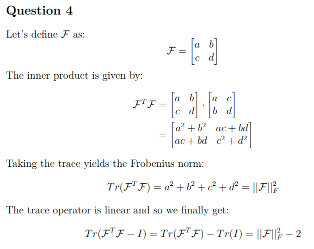
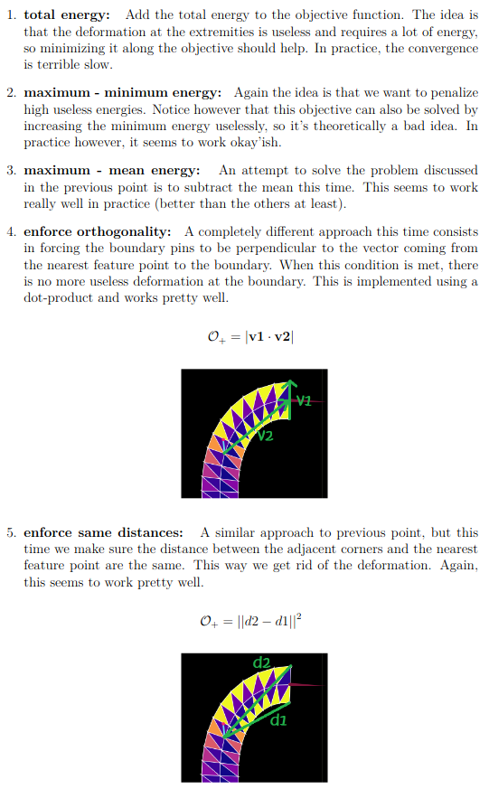

## Infos

First Name: Noureddine

Last Name: Gueddach

---

## Simulations

### 1) **FEM**

</img>

### 2) **Soft manipulation**

</img>

### 2) **Soft manipulation with regularizers**

More details about the regularizers are show under *question 11*

  * **Distance difference regularizer:** Works but might be a bit slow

</img>

  * **Maximum minus Mean energy regularizer:** This seems to work the best.

</img>

**Note I:** the videos are sped up x10

**Note II:** I noticed that putting the control points further apart helps the optimizer as it tends to find a good solution quicker.

---

## Theory Questions

**Solution to Question 4:**

**Solution to Question 10:**

The objective only includes the position difference between the current feature point positions and their target positions. It is easy to see that there are infinitly many handle configurations that minimize the objective function. In other words, the objective/energy landscape has a non-trivial null-space on which the gradient is flat, so the optimizer has no incentive to go and explore other configurations, since as we know gradient descent stops updating when it receives flat gradients.

This being the case, the solution found by the optimizer is heavily depending on the initial configuration (vertically aligned pins in our case). Since it can minimize the objective without changing the pin orientations, it does not bother changing them.

**Solution to Question 11:**

We need a way to include a penalty term in the objective that penalizes the deformations at the extremities. There are many possible options. I list below the ones that I implemented:

