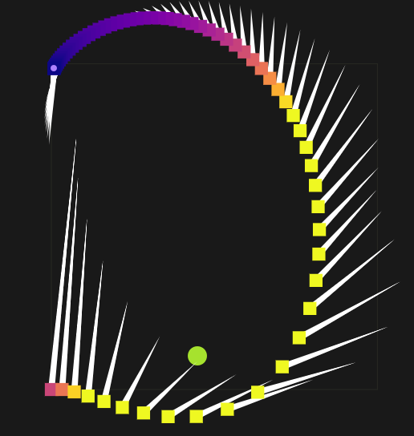
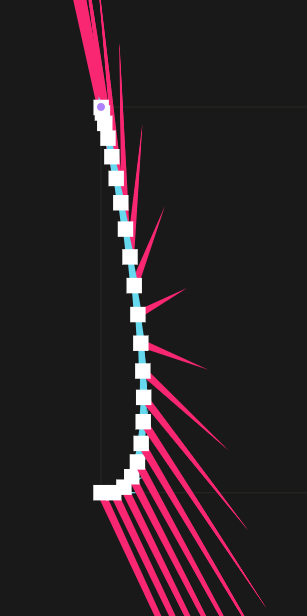
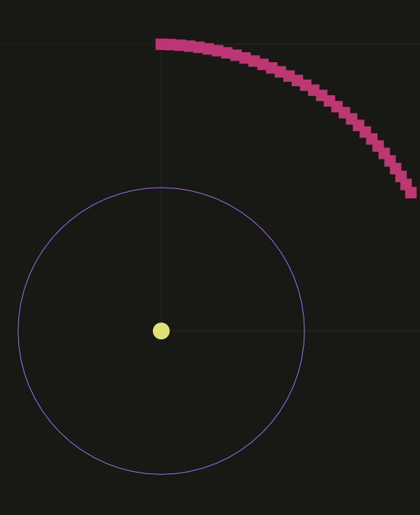

# Assignment 6 - Trajectory Optimization

**Hand-in:** May 27, 2022, 18:00 CEST 

First Name:

Last Name:

Solution to Question 2:

* $a_k = F_k/m = \frac{1}{h}(v_{k+1} - v_k) = \frac{1}{h^2}(x_{k+2} - x_{k+1} - (x_{k+1} - x_k)) = \frac{1}{h^2}(x_{k+2} - 2 x_{k+1} + x_k)$

Solution to Question 5:

* Newton's method typically requires a single optimization step (2 steps in some rare cases, depending on regularizer and starting point). The reason for this is that our objective is convex, and more specifically quadratic. Since Newton's method is a second order method, it has all the information it needs (all information about the underlying function is contained in the value and derivative at current point) to one-shot optimize quadratic functions.

Solution to Question 7:

Solution to Question 8:

The obtained trajectory exactly matches the physically simulated one (both visualizations are enabled):

Solution to Question 9:

Optimizing with gradient descent does not work. Indeed if we start in a flat region of the loss function, the gradient is approximately zero and no progress can be made. Even with line search, the search step should be extremely small to make any progress, which it turns make the optimization process much slower.

Explanation of your approach to Question 10 (required for full credit):

I tried 2 approaches:
  * **Approach 1**:

    The objective consists in 2 parts:

      1. An end-of-trajectory position constraint that makes sure that the distance between the sun and the final trajectory position exactly matches the orbit radius.
      2. An end-of-trajectory velocity constraint. To stay in orbit, one needs a specific orbital velocity given by:

          $v = \sqrt{\frac{G M}{r}}$

          Here we just consider the numerator to be 1 and hence $v = r^{-1/2}$. The velocity direction must be perpendicular to the trajectory and hence all we need to do is to compute the vector from the stun to the final position, take its perpendicular and have its norm equal to $v$.

    With this approach, though the optimization converges, the obtained orbit is slightly elliptical. I tried fixing it by also constraining the position/velocity of the position before-last, but it did not help much. Another thing I tried was to change the entry direction (by changing the sign of the target velocity), but it also did not help. Tweaking the objective function coefficients unfortuantely did not manage to solve the problem either.

    It seems that just specifying an end postion/velocity is not precise enough to account for
    numerical errors that cumulate over the whole orbit.
  
  * **Approach 2**:

    From the last comment in the previous approach, it is then natural to forward-simulate the object
    beyond the final point (even if no more input is allowed) and account for the cumulated errors
    by including them and minimizing for them in the objective function. This new approach yields
    a perfectly circular orbit and alleviates the need for the end-velocity constraint as it is
    now implicit.

    The result is shown below:

    

---

Assignment writeup: http://crl.ethz.ch/teaching/computational-motion-22/slides/Tutorial-Write-Up-6.pdf

---

- NOTE: Don't forget to switch to Release mode or Release With Debug Info otherwise it's gonna be just unimaginably slow.
- NOTE: Tested builds: GCC 9.3 (Linux), Visual Studio 2022 (Windows), Clang 12.0.0 (Mac OS)
